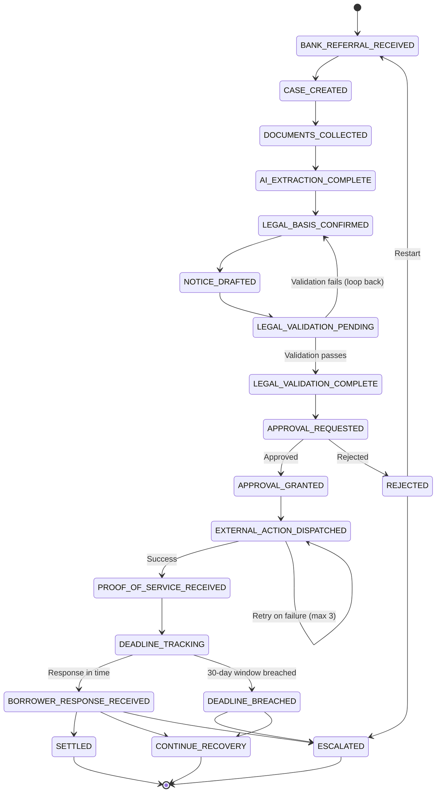

# Bank Recovery Workflow — UX Specification

**Workflow Slug:** `bank_recovery`  
**Status Field:** `recovery_status`  
**Redis Prefix:** `recovery:case:`  
**Version:** 1.0.0  
**States:** 17 (including 3 terminal)  
**Golden Path:** Bank Referral → Canonical Case → Documents → AI Extraction → Legal Basis → Notice Draft → Legal Validation → Approval → Dispatch → Proof of Service → Deadline Tracking → Borrower Response → Terminal (Settled / Escalated / Continue Recovery)

---

## 1. State Machine Overview

### 1.1 States (17 Total)

| # | State | Category | Description |
|---|-------|----------|-------------|
| 1 | `BANK_REFERRAL_RECEIVED` | Initial | Bank referral received; case intake begins |
| 2 | `CASE_CREATED` | Process | Canonical case created in `cases` table |
| 3 | `DOCUMENTS_COLLECTED` | Process | Loan/security documents collected (Loan Agreement, Security Document, Mortgage Deed, Title Deeds) |
| 4 | `AI_EXTRACTION_COMPLETE` | Process | AI extraction from document_versions complete (drafter agent, confidence ≥ 0.75) |
| 5 | `LEGAL_BASIS_CONFIRMED` | **Mandatory Gate** | Advocate confirms legal basis (Section 89B applicability, SARFAESI compliance) |
| 6 | `NOTICE_DRAFTED` | Process | Recovery notice drafted (AI-assisted via drafter agent) |
| 7 | `LEGAL_VALIDATION_PENDING` | Process | Legal validation by advocate (can loop back to LEGAL_BASIS_CONFIRMED if validation fails) |
| 8 | `LEGAL_VALIDATION_COMPLETE` | Process | Legal validation passed |
| 9 | `APPROVAL_REQUESTED` | **Mandatory Gate** | Mandatory approval requested (requires PRINCIPAL or ADVOCATE) |
| 10 | `APPROVAL_GRANTED` | Process | Approval granted |
| 11 | `EXTERNAL_ACTION_DISPATCHED` | Process | Action Gateway dispatched (IGR/GRAS/NeSL/Bank API/Email/WhatsApp/Postal) |
| 12 | `PROOF_OF_SERVICE_RECEIVED` | Process | Proof of service received (retry on failure) |
| 13 | `DEADLINE_TRACKING` | Process | Statutory deadline tracking (Section 89B — 30 days from mortgage creation by deposit of title deeds) |
| 14 | `BORROWER_RESPONSE_RECEIVED` | Process | Borrower response received |
| 15 | `SETTLED` | **Terminal** | Case settled |
| 16 | `ESCALATED` | **Terminal** | Case escalated (rejected approval, deadline breach, or borrower non-response) |
| 17 | `CONTINUE_RECOVERY` | **Terminal** | Continue recovery process (alternative path) |

### 1.2 Transitions



### 1.3 Exception States
- `REJECTED` — Approval rejected; can escalate or restart
- `DEADLINE_BREACHED` — Section 89B 30-day window breached; can escalate or continue recovery

---

## 2. Mandatory Gates (Critical UX)

### 2.1 Legal Basis Confirmation Gate (State: `LEGAL_BASIS_CONFIRMED`)

**Purpose:** Advocate must explicitly confirm legal basis before notice drafting proceeds. This is a **hard block** — no transition forward without confirmation.

**UX Requirements:**
- **Visual Treatment:** Full-screen modal or dedicated screen with prominent warning styling
- **Required Fields:**
  - Legal basis checkbox (Section 89B / SARFAESI / Other — must select one)
  - Legal basis rationale (free text, min 50 chars)
  - Advocate digital signature / confirmation button
  - Timestamp capture (auto)
- **Validation:** Cannot proceed until all fields complete + signature
- **Audit:** Creates `APPROVAL_REQUESTED` audit event with `policy_evaluation_id` linkage
- **Role:** ADVOCATE or PRINCIPAL only

**Screen Layout:**
```
┌─────────────────────────────────────────────────────────────┐
│ ⚠️  LEGAL BASIS CONFIRMATION REQUIRED                       │
│                                                              │
│ Case: RECOVERY-2024-001234  |  Bank: HDFC Bank             │
│ Borrower: Rajesh Kumar    |  Outstanding: ₹2.4 Cr          │
├─────────────────────────────────────────────────────────────┤
│  AI Extraction Complete (Confidence: 94%)                   │
│  Documents: Loan Agreement, Mortgage Deed, Title Deeds ✓    │
├─────────────────────────────────────────────────────────────┤
│  LEGAL BASIS SELECTION *                                    │
│  ☐ Section 89B (Mortgage by deposit of title deeds)        │
│  ☐ SARFAESI Section 13(2)                                  │
│  ☐ Other: _____________________________________________    │
├─────────────────────────────────────────────────────────────┤
│  RATIONALE * (min 50 characters)                            │
│  ┌─────────────────────────────────────────────────────┐   │
│  │ Mortgage created by deposit of title deeds on      │   │
│  │ 2024-01-15. Section 89B 30-day window applies.    │   │
│  └─────────────────────────────────────────────────────┘   │
├─────────────────────────────────────────────────────────────┤
│  ADVOCATE CONFIRMATION *                                    │
│  [I confirm the above legal basis is correct and           │
│   authorize proceeding to notice drafting]                 │
│                                                              │
│  [SIGN & CONFIRM]  ← Primary CTA (disabled until complete) │
│  [BACK TO DOCUMENTS]                                        │
└─────────────────────────────────────────────────────────────┘
```

### 2.2 Mandatory Approval Gate (State: `APPROVAL_REQUESTED`)

**Purpose:** Before any external action (notice dispatch), mandatory approval from PRINCIPAL or ADVOCATE.

**UX Requirements:**
- **Trigger:** Automatic on entering `APPROVAL_REQUESTED` state
- **Approval Type:** `recovery_notice_dispatch` (from workflow definition)
- **Required Approvers:** PRINCIPAL OR ADVOCATE (min 1)
- **SLA:** 2 days (from `approval_requested` deadline)
- **Integration:** Creates `approval_request` record linked to `policy_evaluation` (policy_key: `recovery_notice_dispatch`)

**Approval Queue Screen (for Approver):**
```
┌─────────────────────────────────────────────────────────────┐
│ ⏳ PENDING APPROVAL: Recovery Notice Dispatch              │
│ SLA: 1 day 14 hours remaining                              │
├─────────────────────────────────────────────────────────────┤
│  CASE CONTEXT                                               │
│  Case: RECOVERY-2024-001234  |  State: APPROVAL_REQUESTED  │
│  Bank: HDFC Bank    |  Borrower: Rajesh Kumar              │
│  Outstanding: ₹2.4 Cr  |  Legal Basis: Section 89B ✓       │
├─────────────────────────────────────────────────────────────┤
│  NOTICE PREVIEW (Split View)                                │
│  ┌──────────────────────┬──────────────────────────────┐   │
│  │ 📄 GENERATED NOTICE  │ 📋 EVIDENCE & EXTRACTION     │   │
│  │                      │  • Loan Agreement: p.3-7     │   │
│  │ [Notice content...]  │  • Mortgage Deed: p.8-12     │   │
│  │                      │  • Title Deeds: p.13-18      │   │
│  │                      │  • AI Confidence: 94%        │   │
│  │                      │  • Legal Basis: Confirmed ✓  │   │
│  └──────────────────────┴──────────────────────────────┘   │
├─────────────────────────────────────────────────────────────┤
│  POLICY EVALUATION                                          │
│  Policy: recovery_notice_dispatch  |  Decision: REQUIRE_APPROVAL │
│  Evaluated: 2024-01-20 14:30  |  Evaluator: AI Policy Engine    │
├─────────────────────────────────────────────────────────────┤
│  DECISION                                                   │
│  ○ APPROVE — Dispatch notice via Action Gateway            │
│  ○ REJECT — Return to legal validation (with reason)       │
│  ○ ESCALATE — Escalate to Principal (if Advocate)          │
│                                                              │
│  REASON (required if Reject/Escalate):                      │
│  ┌─────────────────────────────────────────────────────┐   │
│  │                                                      │   │
│  └─────────────────────────────────────────────────────┘   │
│                                                              │
│  [APPROVE & DISPATCH]  ← Primary (green)                   │
│  [REJECT]              ← Secondary (red)                   │
│  [ESCALATE]            ← Tertiary (orange)                 │
└─────────────────────────────────────────────────────────────┘
```

---

## 3. Evidence-First Review (Split View Pattern)

**Applies to States:** `NOTICE_DRAFTED`, `LEGAL_VALIDATION_PENDING`, `APPROVAL_REQUESTED`

**Pattern:** Left pane = Generated artifact (notice, document), Right pane = Source evidence (extracted fields, source documents, AI confidence)

### 3.1 Split View Component Specification

```typescript
interface SplitViewProps {
  leftPane: {
    type: 'notice' | 'document' | 'challan';
    content: ReactNode;
    actions?: ReactNode; // Download, Edit, Regenerate
  };
  rightPane: {
    evidence: EvidenceItem[];
    aiConfidence: number;
    extractionMetadata: ExtractionMetadata;
  };
  resizable: true;
  defaultSplit: 60; // Left pane 60%
  minPaneWidth: 320;
}

interface EvidenceItem {
  id: string;
  label: string;
  sourceDocument: string;
  pageRange: string;
  extractedValue: string;
  confidence: number;
  verified: boolean; // Human verified flag
}
```

### 3.2 Notice Drafting Split View

```
┌────────────────────────────────────────────────────────────────────┐
│ NOTICE DRAFTING — RECOVERY-2024-001234                            │
├────────────────────────────────────────────────────────────────────┤
│ ┌──────────────────────────┬────────────────────────────────────┐ │
│ │ 📝 NOTICE DRAFT (EDITABLE) │ 📋 EVIDENCE PANEL               │ │
│ │                          │                                   │ │
│ │ [Rich text editor with   │  EXTRACTED FIELDS                 │ │
│ │  legal template vars]    │  ┌────────────────────────────┐  │ │
│ │                          │  │ Borrower Name      │ Rajesh Kumar  98% ✓│  │
│ │ TO: Rajesh Kumar         │  │ Property Address   │ 402, Sunrise   95% ✓│ │
│ │ 402, Sunrise Apartments  │  │  Apartments, Thane │                │  │
│ │ Thane West, Mumbai 400601│  │ Loan Amount        │ ₹2,40,00,000  99% ✓│ │
│ │                          │  │ Mortgage Date      │ 2024-01-15     97% ✓│ │
│ │ UNDER SECTION 89B...     │  │ Title Deed Ref     │ TD-2024-04521  93% ✓│ │
│ │                          │  └────────────────────────────┘  │ │
│ │ [Section 89B notice      │                                   │ │
│ │  template with           │  SOURCE DOCUMENTS                 │ │
│ │  variables populated]    │  ┌────────────────────────────┐  │ │
│ │                          │  │ 📄 Loan_Agreement.pdf     │  │ │
│ │                          │  │    Pages 3-7  •  94% conf │  │ │
│ │ [REGENERATE WITH AI]     │  │ 📄 Mortgage_Deed.pdf      │  │ │
│ │ [SAVE DRAFT]             │  │    Pages 8-12  •  97% conf│  │ │
│ │ [PROCEED TO VALIDATION]  │  │ 📄 Title_Deeds.pdf        │  │ │
│ │                          │  │    Pages 13-18 •  93% conf│  │ │
│ │                          │  └────────────────────────────┘  │ │
│ └──────────────────────────┴────────────────────────────────────┘ │
└────────────────────────────────────────────────────────────────────┘
```

---

## 4. Statutory Deadline Visualization

### 4.1 Section 89B — 30-Day Window

**Configuration (from workflow definition):**
- **Label:** "Section 89B statutory deadline"
- **Window:** 30 days
- **Starts From:** "date of mortgage creation by deposit of title deeds"
- **Blocking:** true (workflow cannot proceed past `DEADLINE_TRACKING` if breached)

### 4.2 Deadline Display Component

```typescript
interface DeadlineDisplayProps {
  deadline: {
    label: string;
    type: 'statutory' | 'sla' | 'internal' | 'escalation';
    dueAt: Date;
    startsFrom: string;
    blocking: boolean;
    status: 'pending' | 'triggered' | 'completed' | 'breached' | 'cancelled';
  };
  showCountdown: true;
  showProgress: true;
  onBreach: () => void; // Triggers DEADLINE_BREACHED transition
}
```

### 4.3 Visual States

| Status | Visual Treatment | Countdown | Progress Bar | Actions |
|--------|------------------|-----------|--------------|---------|
| `pending` | Blue accent, calm | Days HH:MM:SS | Green → Yellow at 50% | Monitor |
| `triggered` | Orange accent, pulsing | Hours:MM:SS | Yellow → Red at 80% | Accelerate actions |
| `completed` | Green accent, checkmark | — | 100% Green | Archive |
| `breached` | **Red alert**, banner, vibration (mobile) | **BREACHED** | Red, 100% | **Force transition to ESCALATED/CONTINUE_RECOVERY** |
| `cancelled` | Gray, strikethrough | — | — | — |

### 4.4 Deadline Dashboard (Aggregated View)

```
┌─────────────────────────────────────────────────────────────────┐
│ ⏰ STATUTORY DEADLINES — Bank Recovery Portfolio               │
├─────────────────────────────────────────────────────────────────┤
│ FILTERS: [All] [This Week] [This Month] [Overdue] [Search...]  │
├─────────────────────────────────────────────────────────────────┤
│ CASE              │ DEADLINE                    │ STATUS   │ ACT │
├───────────────────┼─────────────────────────────┼──────────┼─────┤
│ RECOVERY-001234   │ Section 89B (30 days)       │ 🟠 3d    │ 👁  │
│   HDFC / Rajesh   │ From: 2024-01-15            │ 27h left │     │
│   ─────────────── │ Due: 2024-02-14 23:59       │ [=======>]│     │
├───────────────────┼─────────────────────────────┼──────────┼─────┤
│ RECOVERY-001235   │ Dispatch SLA (1 day)        │ 🔴 BREACH│ ⚡  │
│   SBI / Priya     │ From: 2024-01-20            │ 2h ago   │     │
│   ─────────────── │ Due: 2024-01-21 14:30       │ [=========]│     │
├───────────────────┼─────────────────────────────┼──────────┼─────┤
│ RECOVERY-001236   │ Proof of Service (3 days)   │ 🟢 Done  │ ✓   │
│   ICICI / Amit    │ From: 2024-01-18            │ Complete │     │
│   ─────────────── │ Due: 2024-01-21 18:00       │ [=========]│     │
└───────────────────┴─────────────────────────────┴──────────┴─────┘
```

---

## 5. Approver Mental Model

### 5.1 What the Approver Sees

**Context Package Delivered to Approver:**
1. **Case Summary** — Bank, borrower, outstanding amount, collateral
2. **Legal Basis Confirmation** — Section cited, advocate who confirmed, timestamp
3. **AI Extraction Evidence** — Split view of notice vs. source documents
4. **Policy Evaluation Result** — `REQUIRE_APPROVAL` with reasoning
5. **Notice Draft** — Full rendered notice with variables populated
6. **Dispatch Channels Selected** — IGR, GRAS, NeSL, Email, WhatsApp, Postal
7. **Audit Trail** — Immutable hash-linked events leading to this point

### 5.2 What the Approver Decides

| Decision | Effect | Next State | Audit Event |
|----------|--------|------------|-------------|
| **APPROVE** | Notice dispatched via Action Gateway | `EXTERNAL_ACTION_DISPATCHED` | `APPROVAL_GRANTED` |
| **REJECT** | Return to `LEGAL_VALIDATION_PENDING` with reason | `LEGAL_VALIDATION_PENDING` | `APPROVAL_DENIED` |
| **ESCALATE** | Route to Principal (if Advocate) or flag | `APPROVAL_REQUESTED` (re-queued) | `APPROVAL_ESCALATED` |

### 5.3 Approver Decision Record (Immutable)

```json
{
  "approval_id": "uuid",
  "case_id": "RECOVERY-2024-001234",
  "decision": "APPROVED",
  "decided_by": "advocate_001",
  "decided_at": "2024-01-20T15:30:00Z",
  "reason": "Legal basis confirmed, notice complies with Section 89B requirements",
  "payload_hash": "sha256_of_notice_payload",
  "policy_evaluation_id": "uuid",
  "object_version": "notice_v3"
}
```

---

## 6. Policy Gate Visibility

### 6.1 Policy Gates (from workflow definition)

| Stage | Policy Key | Required Decision | UX Treatment |
|-------|------------|-------------------|--------------|
| `NOTICE_DRAFTED` | `recovery_notice_dispatch` | `ALLOW` | Inline banner: "Policy check required before approval" |
| `EXTERNAL_ACTION_DISPATCHED` | `recovery_external_action` | `ALLOW` | Inline banner: "Action Gateway policy evaluation pending" |

### 6.2 Policy Evaluation Display

```
┌─────────────────────────────────────────────────────────────┐
│ 🛡️ POLICY GATE: recovery_notice_dispatch                   │
│ Status: EVALUATING... (spinner)                             │
├─────────────────────────────────────────────────────────────┤
│ RULES EVALUATED:                                            │
│  ✓ Legal basis confirmed by ADVOCATE                       │
│  ✓ AI extraction confidence ≥ 75% (actual: 94%)            │
│  ✓ Notice template approved for bank: HDFC                 │
│  ✓ Outstanding amount within delegate authority (₹2.4Cr)   │
│  ⚠ Borrower category: Individual (not corporate)           │
├─────────────────────────────────────────────────────────────┤
│ RESULT: REQUIRE_APPROVAL                                    │
│ Reason: Individual borrower requires advocate approval     │
│                                                              │
│ [VIEW FULL EVALUATION]  [REQUEST APPROVAL]                 │
└─────────────────────────────────────────────────────────────┘
```

---

## 7. Action Gateway Integration (LIVE/SANDBOX/MOCK)

### 7.1 Dispatch Stage: `EXTERNAL_ACTION_DISPATCHED`

**Supported Channels:** IGR, GRAS, NeSL, BANK_API, EMAIL, WHATSAPP, POSTAL

### 7.2 Channel Status Badges

```typescript
type ChannelMode = 'LIVE' | 'SANDBOX' | 'MOCK';

interface ChannelBadgeProps {
  channel: string;
  mode: ChannelMode;
  lastSync?: Date;
  health: 'healthy' | 'degraded' | 'down';
}
```

**Visual Language:**
- **LIVE** — Green badge, solid: `● LIVE`
- **SANDBOX** — Blue badge, outline: `◐ SANDBOX`
- **MOCK** — Gray badge, dashed: `○ MOCK`

### 7.3 Dispatch Screen

```
┌─────────────────────────────────────────────────────────────────┐
│ 🚀 DISPATCH RECOVERY NOTICE — RECOVERY-2024-001234             │
│ Approval: GRANTED (Advocate A. Sharma, 2024-01-20 15:30)       │
├─────────────────────────────────────────────────────────────────┤
│ CHANNEL SELECTION                                               │
│ ┌─────────────┬────────┬─────────┬──────────────────────────┐  │
│ │ Channel     │ Mode   │ Status  │ Payload Preview          │  │
│ ├─────────────┼────────┼─────────┼──────────────────────────┤  │
│ │ ☑ IGR       │ ● LIVE │ 🟢 OK   │ Filing: Notice u/s 89B   │  │
│ │ ☑ GRAS      │ ● LIVE │ 🟢 OK   │ Challan: ₹2.4Cr stamp    │  │
│ │ ☐ NeSL      │ ◐ SBX  │ 🟡 WARN │ Registration pending     │  │
│ │ ☑ EMAIL     │ ● LIVE │ 🟢 OK   │ To: borrower@email.com   │  │
│ │ ☑ WHATSAPP  │ ● LIVE │ 🟢 OK   │ To: +91-98765-43210      │  │
│ │ ☐ POSTAL    │ ○ MOCK │ ⚪ N/A  │ Speed post, tracking req │  │
│ └─────────────┴────────┴─────────┴──────────────────────────┘  │
├─────────────────────────────────────────────────────────────────┤
│ IDEMPOTENCY KEY: recovery:case-1234:notice_dispatch:igr        │
│ RETRY POLICY: Max 3 retries, 5min backoff, retry on timeout    │
├─────────────────────────────────────────────────────────────────┤
│ [DISPATCH ALL SELECTED]  ← Primary (requires APPROVED status)  │
│ [SAVE AS DRAFT]                                                │
└─────────────────────────────────────────────────────────────────┘
```

### 7.4 Dispatch Progress & Proof of Service

```
┌─────────────────────────────────────────────────────────────────┐
│ 📤 DISPATCH IN PROGRESS — RECOVERY-2024-001234                 │
├─────────────────────────────────────────────────────────────────┤
│ CHANNEL          │ ATTEMPT │ STATUS      │ EXTERNAL REF    │   │
├──────────────────┼─────────┼─────────────┼─────────────────┤   │
│ IGR Filing       │ 1       │ ✅ SUCCEEDED │ IGR-2024-04521 │   │
│ GRAS Challan     │ 1       │ ✅ SUCCEEDED │ GRN-789456123  │   │
│ Email            │ 1       │ ✅ SUCCEEDED │ MSG-ID-abc123  │   │
│ WhatsApp         │ 2       │ 🔄 RETRYING  │ —              │   │
│                  │ 1       │ ❌ FAILED    │ Timeout 30s    │   │
└──────────────────┴─────────┴─────────────┴─────────────────┘   │
│                                                                 │
│ PROOF OF SERVICE REQUIRED FOR: WhatsApp (retry 2/3)            │
│ [UPLOAD PROOF]  [RETRY WHATSAPP]  [SKIP CHANNEL]               │
└─────────────────────────────────────────────────────────────────┘
```

---

## 8. Task Definitions (From Workflow)

| Task Definition ID | Stage | Assignee Role | Description |
|--------------------|-------|---------------|-------------|
| `collect_documents` | `DOCUMENTS_COLLECTED` | CLERK/EXECUTIVE | Collect loan agreement, security docs, mortgage deed, title deeds |
| `run_ai_extraction` | `AI_EXTRACTION_COMPLETE` | SYSTEM (drafter agent) | Extract key fields from documents via AI |
| `confirm_legal_basis` | `LEGAL_BASIS_CONFIRMED` | ADVOCATE | **Mandatory gate** — Confirm Section 89B applicability |
| `draft_notice` | `NOTICE_DRAFTED` | ADVOCATE/CLERK | Draft recovery notice (AI-assisted) |
| `legal_validation` | `LEGAL_VALIDATION_PENDING` | ADVOCATE | Validate notice legally (can loop back) |
| `request_approval` | `APPROVAL_REQUESTED` | SYSTEM | Create approval request for notice dispatch |
| `dispatch_action` | `EXTERNAL_ACTION_DISPATCHED` | SYSTEM/EXECUTIVE | Dispatch via Action Gateway |
| `verify_service` | `PROOF_OF_SERVICE_RECEIVED` | CLERK/EXECUTIVE | Collect proof of service for each channel |
| `track_deadline` | `DEADLINE_TRACKING` | SYSTEM | Monitor Section 89B 30-day window |
| `process_response` | `BORROWER_RESPONSE_RECEIVED` | ADVOCATE | Process borrower response, decide terminal state |

---

## 9. Audit Capture Requirements

**All events captured (from workflow definition):**
- ✅ AI Runs (extraction, drafting)
- ✅ Policy Evaluations (both gates)
- ✅ Approval Requests (mandatory gate)
- ✅ External Actions (dispatch attempts)
- ✅ Action Attempts (retries, failures)
- ✅ Deadline Events (triggered, breached, completed)

**Audit Event Types Used:**
- `WORKFLOW_INSTANCE_STARTED`
- `TASK_CREATED` / `TASK_COMPLETED`
- `AI_RUN_STARTED` / `AI_RUN_COMPLETED`
- `POLICY_EVALUATED`
- `APPROVAL_REQUESTED` / `APPROVAL_GRANTED` / `APPROVAL_DENIED`
- `EXTERNAL_ACTION` (with attempt details)
- `DEADLINE_TRIGGERED` / `DEADLINE_BREACHED`

---

## 10. Screen Inventory (Bank Recovery)

| Screen | State(s) | Primary User | Key Components |
|--------|----------|--------------|----------------|
| Case Intake | `BANK_REFERRAL_RECEIVED` → `CASE_CREATED` | CLERK | Bank referral form, case creation |
| Document Collection | `DOCUMENTS_COLLECTED` | CLERK/EXECUTIVE | Document upload, checklist (4 required types) |
| AI Extraction Review | `AI_EXTRACTION_COMPLETE` | ADVOCATE | Split view: extracted fields vs source docs |
| **Legal Basis Confirmation** | `LEGAL_BASIS_CONFIRMED` | **ADVOCATE** | **Mandatory gate modal** |
| Notice Drafting | `NOTICE_DRAFTED` | ADVOCATE/CLERK | Rich editor + evidence split view |
| Legal Validation | `LEGAL_VALIDATION_PENDING` | ADVOCATE | Review + approve/return |
| **Approval Queue** | `APPROVAL_REQUESTED` | **PRINCIPAL/ADVOCATE** | **Approval decision screen** |
| Dispatch Control | `EXTERNAL_ACTION_DISPATCHED` | EXECUTIVE | Channel selection, mode badges, retry |
| Proof of Service | `PROOF_OF_SERVICE_RECEIVED` | CLERK | Upload proofs per channel |
| Deadline Tracking | `DEADLINE_TRACKING` | ADVOCATE/OPERATIONS | Countdown, progress, breach alert |
| Borrower Response | `BORROWER_RESPONSE_RECEIVED` | ADVOCATE | Response intake, terminal decision |
| Terminal Screens | `SETTLED`/`ESCALATED`/`CONTINUE_RECOVERY` | ALL | Summary, audit trail, next steps |

---

## 11. Responsive Breakpoints

| Breakpoint | Layout Adjustments |
|------------|-------------------|
| Mobile (< 640px) | Stacked split view (evidence below), full-screen modals for gates, bottom-sheet for approval queue |
| Tablet (640-1024px) | Side-by-side split view (50/50), collapsible evidence panel |
| Desktop (> 1024px) | Default 60/40 split, multi-column deadline dashboard, persistent sidebar |

---

## 12. Accessibility (WCAG 2.2 AA)

- **Focus Management:** Gate modals trap focus, return to trigger on dismiss
- **Color Contrast:** Deadline status colors meet 4.5:1 (red/amber/green with icons, not color-only)
- **Screen Readers:** Live regions for countdown updates, aria-labels on channel badges
- **Keyboard:** All actions reachable via Tab/Enter, Escape closes modals
- **Motion:** Reduced-motion respected for pulsing deadline indicators

---

## 13. Integration Points (Backend)

| Integration | Table/Function | UX Trigger |
|-------------|----------------|------------|
| Workflow Instance | `workflow_instances` | State transitions drive screen navigation |
| Tasks | `tasks` | Task assignment → notification → screen deep-link |
| Deadlines | `deadlines` | Real-time countdown via WebSocket/polling |
| Approvals | `approval_requests` | Approval queue polling, push notification |
| External Actions | `external_actions` + `action_attempts` | Dispatch progress, retry UI |
| Audit | `audit_trail` + `audit_log` | Immutable history panel, hash verification |
| AI Runs | `ai_runs` | Extraction confidence, prompt version display |

---

*Document Version: 1.0.0*  
*Generated from: 0009_workflow_persistence.sql, 0010_bank_recovery_workflow.sql, 0010_external_actions.sql, 0009_approval_requests.sql*