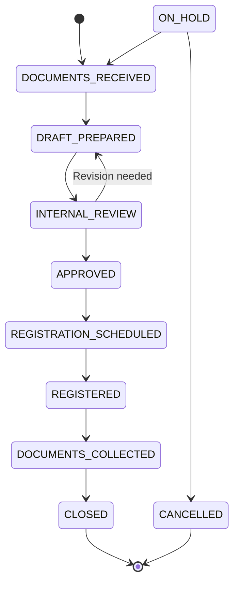

# Mortgage Registration Workflow — UX Specification

**Workflow Slug:** `mortgage_registration`  
**Status Field:** `mortgage_status`  
**Redis Prefix:** `mortgage:case:`  
**Version:** 1.0.0  
**States:** 8 (including 2 terminal + 2 exception)  
**Primary Path:** Documents Received → Draft Prepared → Internal Review → Approved → Registration Scheduled → Registered → Documents Collected → Closed

---

## 1. State Machine Overview

### 1.1 States (8 Total)

| # | State | Category | Description |
|---|-------|----------|-------------|
| 1 | `DOCUMENTS_RECEIVED` | Initial | Title deeds, loan agreement, property docs received |
| 2 | `DRAFT_PREPARED` | Process | Mortgage deed draft prepared (AI-assisted) |
| 3 | `INTERNAL_REVIEW` | Process | Internal legal review by advocate |
| 4 | `APPROVED` | **Gate** | Draft approved for registration |
| 5 | `REGISTRATION_SCHEDULED` | Process | Appointment booked with Sub-Registrar Office (SRO) |
| 6 | `REGISTERED` | Process | Mortgage registered at SRO |
| 7 | `DOCUMENTS_COLLECTED` | Process | Registered documents collected from SRO |
| 8 | `CLOSED` | **Terminal** | Process complete |
| 9 | `CANCELLED` | **Terminal (Exception)** | Cancelled |
| 10 | `ON_HOLD` | **Exception** | On hold (can return to DOCUMENTS_RECEIVED or go to CANCELLED) |

### 1.2 Transitions



### 1.3 Exception States
- `ON_HOLD` — Process paused (missing docs, client delay, SRO unavailable); can resume or cancel
- `CANCELLED` — Client withdrew, property dispute, etc.

---

## 2. Key Gates (No Mandatory Approval Gate)

**Note:** Unlike Bank Recovery, Mortgage Registration has **no mandatory approval gate** requiring PRINCIPAL/ADVOCATE approval before external action. The `INTERNAL_REVIEW` → `APPROVED` transition serves as the quality gate.

### 2.1 Internal Review Gate (State: `INTERNAL_REVIEW` → `APPROVED`)

**Purpose:** Advocate reviews and approves draft mortgage deed

**UX Requirements:**
- Split-view: Draft deed vs. source documents (title deeds, loan agreement)
- Clause-by-clause review checklist
- Advocate approval signature required
- Can return to `DRAFT_PREPARED` for revisions (loop)

---

## 3. Evidence-First Review (Split View)

### 3.1 Draft Preparation Screen (`DRAFT_PREPARED`)

```
┌─────────────────────────────────────────────────────────────────┐
│ 📝 MORTGAGE DEED DRAFTING — MORT-2024-001234                   │
├─────────────────────────────────────────────────────────────────┤
│ ┌──────────────────────────┬────────────────────────────────┐  │
│ │ 📄 MORTGAGE DEED DRAFT   │ 📋 SOURCE EVIDENCE             │  │
│ │ (Rich Editor - Template) │                                 │  │
│ │                          │  PROPERTY DETAILS              │  │
│ │ MORTGAGE DEED            │  ┌──────────────────────────┐  │  │
│ │ ─────────────────        │  │ Property: Flat 402       │  │  │
│ │ This Deed of Mortgage    │  │ Sunrise Apartments       │ 98%│  │
│ │ made on [DATE]           │  │ Thane West, Mumbai 400601│    │  │
│ │                          │  │ Area: 1,200 sq ft        │ 95%│  │
│ │ BETWEEN                   │  │ Market Value: ₹3.5 Cr     │ 92%│  │
│ │ [BORROWER]               │  └──────────────────────────┘  │  │
│ │ Rajesh Kumar             │                                 │  │
│ │ 402, Sunrise Apts...     │  LOAN DETAILS                  │  │
│ │                          │  ┌──────────────────────────┐  │  │
│ │ AND                       │  │ Loan Amount: ₹2.4 Cr     │ 99%│  │
│ │ [LENDER]                 │  │ Interest: 9.25% p.a.     │ 97%│  │
│ │ HDFC Bank Ltd            │  │ Tenure: 20 years         │ 96%│  │
│ │                          │  │ EMI: ₹22,145             │ 94%│  │
│ │ WHEREAS...               │  └──────────────────────────┘  │  │
│ │                          │                                 │  │
│ │ [CLAUSE 1: DEFINITIONS]  │  TITLE DEEDS                   │  │
│ │ [CLAUSE 2: MORTGAGE]     │  ┌──────────────────────────┐  │  │
│ │ [CLAUSE 3: REPAYMENT]    │  │ Sale_Deed.pdf            │  │  │
│ │ [CLAUSE 4: INSURANCE]    │  │ Pages 1-8 • 97% conf     │  │  │
│ │ [CLAUSE 5: DEFAULT]      │  │ Previous_Mortgage.pdf    │  │  │
│ │ [CLAUSE 6: REGISTRATION] │  │ Pages 9-12 • 93% conf    │  │  │
│ │                          │  └──────────────────────────┘  │  │
│ │ [REGENERATE WITH AI]     │                                 │  │
│ │ [SAVE DRAFT]             │  AI CONFIDENCE: 96%            │  │
│ │ [SUBMIT FOR REVIEW]      │  [RE-RUN EXTRACTION]           │  │
│ └──────────────────────────┴────────────────────────────────┘  │
└─────────────────────────────────────────────────────────────────┘
```

### 3.2 Internal Review Screen (`INTERNAL_REVIEW`)

```
┌─────────────────────────────────────────────────────────────────┐
│ 👁️ INTERNAL LEGAL REVIEW — MORT-2024-001234                    │
├─────────────────────────────────────────────────────────────────┤
│ REVIEW CHECKLIST                                               │
│ ┌─────────────────────────────────────────────────────────────┐ │
│ │ CLAUSE-BY-CLAUSE REVIEW                                    │ │
│ │ ☑ Clause 1: Definitions — Accurate, complete               │ │
│ │ ☑ Clause 2: Mortgage creation — Section 58 TP Act compliant│ │
│ │ ☑ Clause 3: Repayment terms — Matches loan agreement       │ │
│ │ ☐ Clause 4: Insurance — **Missing: bank clause reference** │ │
│ │ ☑ Clause 5: Default — SARFAESI compliant                   │ │
│ │ ☑ Clause 6: Registration — SRO jurisdiction correct        │ │
│ │ ☑ Stamp duty calculation — Article 40, ₹1.2L correct       │ │
│ │ ☑ Registration fee — ₹30,000 correct                       │ │
│ ├─────────────────────────────────────────────────────────────┤ │
│ │ DATA CONSISTENCY CHECK                                      │ │
│ │ ☑ Borrower name matches all documents                       │ │
│ │ ☑ Property description matches title deed                   │ │
│ │ ☑ Loan amount matches sanction letter                       │ │
│ │ ☑ PAN/TAN verified for both parties                         │ │
│ └─────────────────────────────────────────────────────────────┘ │
├─────────────────────────────────────────────────────────────────┤
│ ┌──────────────────────────┬────────────────────────────────┐  │
│ │ 📄 DRAFT DEED (READ ONLY)│ 📋 ANNOTATIONS & SOURCES       │  │
│ │                          │  ⚠️ Clause 4: Add bank's       │  │
│ │ [Full deed content...]   │     insurance clause per       │  │
│ │                          │     sanction letter (p.7)      │  │
│ │                          │  📎 Source: Sanction_Letter.pdf│  │
│ └──────────────────────────┴────────────────────────────────┘  │
├─────────────────────────────────────────────────────────────────┤
│ [APPROVE & SCHEDULE REGISTRATION]  ← Primary (green)           │
│ [RETURN FOR REVISION]              ← Secondary (orange)        │
│ [PLACE ON HOLD]                    ← Tertiary (gray)           │
└─────────────────────────────────────────────────────────────────┘
```

---

## 4. Registration Scheduling & SRO Integration

### 4.1 Registration Scheduling Screen (`REGISTRATION_SCHEDULED`)

```
┌─────────────────────────────────────────────────────────────────┐
│ 📅 REGISTRATION SCHEDULING — MORT-2024-001234                  │
├─────────────────────────────────────────────────────────────────┤
│ SRO DETAILS                                                     │
│ Sub-Registrar Office: Thane SRO-3                              │
│ Address: Collector Office Compound, Thane West                 │
│ Jurisdiction: Confirmed ✓                                      │
├─────────────────────────────────────────────────────────────────┤
│ APPOINTMENT BOOKING                                             │
│ ┌─────────────────────────────────────────────────────────────┐ │
│ │ Available Slots (Next 7 Days):                             │ │
│ │ ☐ 2024-01-22 10:00 AM — Slot 3/5 available                │ │
│ │ ☐ 2024-01-22 11:30 AM — Slot 2/5 available                │ │
│ │ ☑ 2024-01-23 10:00 AM — **SELECTED** (4/5)                │ │
│ │ ☐ 2024-01-23 02:00 PM — Slot 5/5 available                │ │
│ │ ☐ 2024-01-24 10:00 AM — Slot 1/5 available                │ │
│ └─────────────────────────────────────────────────────────────┘ │
├─────────────────────────────────────────────────────────────────┤
│ REQUIRED ATTENDEES                                              │
│ ☑ Borrower: Rajesh Kumar (confirmed)                           │
│ ☑ Bank Rep: HDFC Bank (confirmed)                              │
│ ☑ Advocate: A. Sharma (confirmed)                              │
│ ☐ Witness 1: [TO BE ARRANGED]                                  │
│ ☐ Witness 2: [TO BE ARRANGED]                                  │
├─────────────────────────────────────────────────────────────────┤
│ DOCUMENTS TO CARRY                                              │
│ ☑ Original Title Deeds                                         │
│ ☑ Mortgage Deed (2 copies + 1 for SRO)                        │
│ ☑ Loan Agreement                                               │
│ ☑ PAN Cards (Borrower + Bank Authorized Signatory)            │
│ ☑ Aadhaar Cards                                                │
│ ☑ Passport Photos (4 each)                                     │
│ ☑ Stamp Duty Challan (GRAS paid)                               │
│ ☑ Registration Fee Challan                                     │
├─────────────────────────────────────────────────────────────────┤
│ [CONFIRM APPOINTMENT]  ← Primary                               │
│ [RESCHEDULE]                                                    │
└─────────────────────────────────────────────────────────────────┘
```

### 4.2 Registration Completion Screen (`REGISTERED`)

```
┌─────────────────────────────────────────────────────────────────┐
│ ✅ REGISTRATION COMPLETE — MORT-2024-001234                    │
├─────────────────────────────────────────────────────────────────┤
│ REGISTRATION DETAILS                                           │
│ SRO: Thane SRO-3                                               │
│ Date: 2024-01-23 10:15 AM                                      │
│ Registration Number: MORT/THN/2024/001234                      │
│ Book: 1, Volume: 45, Pages: 120-135                            │
├─────────────────────────────────────────────────────────────────┤
│ DOCUMENTS RECEIVED FROM SRO                                    │
│ ┌─────────────────────────────────────────────────────────────┐ │
│ │ ☑ Registered Mortgage Deed (Original)                      │ │
│ │ ☑ Certified Copy (for bank)                                │ │
│ │ ☑ Index II Extract                                         │ │
│ │ ☑ Receipt: ₹1.5 Lakhs (Stamp Duty + Registration)          │ │
│ └─────────────────────────────────────────────────────────────┘ │
├─────────────────────────────────────────────────────────────────┤
│ [COLLECT DOCUMENTS FROM SRO]  ← Primary (advances to next)     │
│ [VIEW REGISTRATION CERTIFICATE]                                 │
└─────────────────────────────────────────────────────────────────┘
```

---

## 5. Task Definitions

| Task Definition ID | Stage | Assignee Role | Description |
|--------------------|-------|---------------|-------------|
| `collect_documents` | `DOCUMENTS_RECEIVED` | CLERK | Collect title deeds, loan agreement, property docs, KYC |
| `prepare_draft` | `DRAFT_PREPARED` | CLERK/ADVOCATE | Prepare mortgage deed draft (AI-assisted) |
| `internal_review` | `INTERNAL_REVIEW` | ADVOCATE | Legal review of draft, clause-by-clause |
| `approve_draft` | `APPROVED` | ADVOCATE | Approve draft for registration |
| `schedule_registration` | `REGISTRATION_SCHEDULED` | EXECUTIVE | Book SRO appointment, coordinate attendees |
| `attend_registration` | `REGISTERED` | EXECUTIVE/ADVOCATE | Attend SRO, complete registration |
| `collect_documents` | `DOCUMENTS_COLLECTED` | CLERK | Collect registered documents from SRO |
| `close_case` | `CLOSED` | ADVOCATE | Final review, handover to bank, close |

---

## 6. Approver Mental Model

**No external approval gate.** The advocate serves as both drafter and reviewer.

### 6.1 Advocate Review Decisions

| Decision | Effect | Next State |
|----------|--------|------------|
| **APPROVE** | Draft legally sound | `REGISTRATION_SCHEDULED` |
| **REVISE** | Issues found | `DRAFT_PREPARED` (loop) |
| **HOLD** | External dependency | `ON_HOLD` |

---

## 7. Policy Gates

**None defined in workflow definition** — Relies on advocate review gate.

---

## 8. Action Gateway Integration

**Not applicable** — Mortgage Registration uses direct SRO interaction (physical/online appointment), not the generic Action Gateway.

---

## 9. Deadlines

**No statutory deadlines defined in workflow definition** (`deadlines: {}`).

**Operational SLAs (recommended for UX):**
- Draft preparation: 3 days from document receipt
- Internal review: 2 days from draft submission
- SRO scheduling: 5 days from approval
- Document collection: 3 days from registration

---

## 10. Screen Inventory (Mortgage Registration)

| Screen | State(s) | Primary User | Key Components |
|--------|----------|--------------|----------------|
| Document Intake | `DOCUMENTS_RECEIVED` | CLERK | Document checklist, upload |
| Draft Preparation | `DRAFT_PREPARED` | CLERK/ADVOCATE | Template editor + evidence split view |
| **Internal Review** | `INTERNAL_REVIEW` | **ADVOCATE** | **Clause checklist + annotations** |
| Registration Scheduling | `REGISTRATION_SCHEDULED` | EXECUTIVE | SRO slot picker, attendee coordination |
| Registration Day | `REGISTERED` | EXECUTIVE/ADVOCATE | Check-in, document verification |
| Document Collection | `DOCUMENTS_COLLECTED` | CLERK | Receipt confirmation, handover prep |
| Case Closure | `CLOSED` | ADVOCATE | Final summary, bank handover, audit trail |
| On Hold | `ON_HOLD` | ADVOCATE/OPERATIONS | Hold reason, resume/cancel actions |

---

## 11. On Hold Flow (`ON_HOLD` State)

```
┌─────────────────────────────────────────────────────────────────┐
│ ⏸️ CASE ON HOLD — MORT-2024-001234                             │
├─────────────────────────────────────────────────────────────────┤
│ HOLD REASON:                                                   │
│ ┌─────────────────────────────────────────────────────────────┐ │
│ │ ☐ Awaiting borrower document                               │ │
│ │ ☐ SRO appointment unavailable > 30 days                   │ │
│ │ ☐ Title dispute / legal opinion needed                    │ │
│ ☑ Bank sanction letter revision pending                      │ │
│ │ ☐ Other: _______________________________________________  │ │
│ └─────────────────────────────────────────────────────────────┘ │
├─────────────────────────────────────────────────────────────────┤
│ EXPECTED RESOLUTION: 2024-01-30                                │
│ DAYS ON HOLD: 12                                               │
├─────────────────────────────────────────────────────────────────┤
│ [RESUME — DOCUMENTS RECEIVED]  ← Return to document collection │
│ [RESUME — INTERNAL REVIEW]   ← If review was complete          │
│ [CANCEL CASE]                ← Terminal                        │
└─────────────────────────────────────────────────────────────────┘
```

---

## 12. Audit Capture

**Events to capture:**
- `WORKFLOW_INSTANCE_STARTED`
- `TASK_CREATED` / `TASK_COMPLETED` (each stage)
- `DOCUMENT_VERSION_CREATED` (draft versions, registered deed)
- `WORKFLOW_INSTANCE_COMPLETED` (on CLOSED)

---

## 13. Integration Points

| Integration | Table/Function | UX Trigger |
|-------------|----------------|------------|
| Workflow Instance | `workflow_instances` (slug: `mortgage_registration`) | State-driven navigation |
| Tasks | `tasks` | Task assignment per stage |
| Documents | `document_versions` | Draft versions, registered deed |
| Audit | `audit_trail` | History panel |

---

## 14. Responsive & Accessibility

Same standards as Bank Recovery workflow (WCAG 2.2 AA, responsive breakpoints).

---

*Document Version: 1.0.0*  
*Generated from: 0009_workflow_persistence.sql (mortgage_registration seed)*