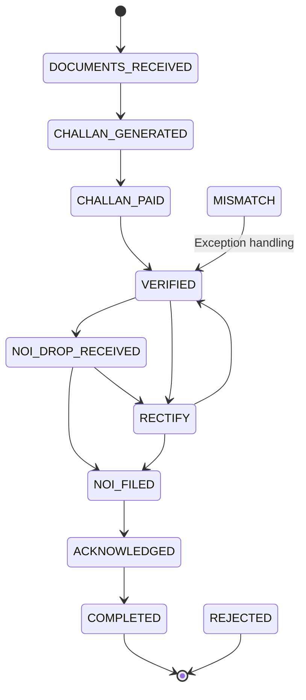

# NOI (Notice of Intimation) Workflow — UX Specification

**Workflow Slug:** `noi`  
**Status Field:** `noi_status`  
**Redis Prefix:** `noi:case:`  
**Version:** 1.0.0  
**States:** 10 (including 2 terminal + 2 exception)  
**Primary Path:** Documents Received → Challan Generated → Challan Paid → Verified → NOI Drop Received → NOI Filed → Acknowledged → Completed

---

## 1. State Machine Overview

### 1.1 States (10 Total)

| # | State | Category | Description |
|---|-------|----------|-------------|
| 1 | `DOCUMENTS_RECEIVED` | Initial | Documents received from bank/client |
| 2 | `CHALLAN_GENERATED` | Process | Challan generated for stamp duty payment |
| 3 | `CHALLAN_PAID` | Process | Challan payment confirmed (GRAS/IGR) |
| 4 | `VERIFIED` | Process | Documents verified by advocate |
| 5 | `NOI_DROP_RECEIVED` | Process | NOI drop (acknowledgment from Sub-Registrar) received |
| 6 | `RECTIFY` | **Exception** | Rectification required (mismatch, missing docs) |
| 7 | `NOI_FILED` | Process | NOI formally filed with Sub-Registrar |
| 8 | `ACKNOWLEDGED` | Process | Filing acknowledged by Sub-Registrar |
| 9 | `COMPLETED` | **Terminal** | NOI process complete |
| 10 | `REJECTED` | **Terminal (Exception)** | Rejected (from MISMATCH) |

### 1.2 Transitions



### 1.3 Exception States
- `RECTIFY` — Document mismatch or missing info; can go to `NOI_FILED` or back to `VERIFIED`
- `MISMATCH` — Data mismatch detected; transitions to `VERIFIED` after resolution

---

## 2. Mandatory Gates

### 2.1 Section 89B Filing Window (State: `DOCUMENTS_RECEIVED`)

**Statutory Deadline:** 30 days from "date of the mortgage — deposit of title deeds"

**Configuration (from workflow definition):**
- **Label:** "Section 89B filing window"
- **Window:** 30 days
- **Starts From:** "date of the mortgage — deposit of title deeds"
- **Blocking:** true

**UX Treatment:** Prominent deadline banner on `DOCUMENTS_RECEIVED` screen with countdown. Cannot proceed to `CHALLAN_GENERATED` if deadline breached (workflow moves to exception handling).

### 2.2 Verification Gate (State: `VERIFIED`)

**Purpose:** Advocate verifies documents before NOI drop/filing

**UX Requirements:**
- Split-view: Generated NOI vs. source documents
- Checklist: All required documents present, data matches, stamp duty paid
- Advocate digital confirmation required
- Can transition to `RECTIFY` if issues found

---

## 3. Evidence-First Review (Split View)

### 3.1 Challan Generation Screen (`CHALLAN_GENERATED`)

```
┌─────────────────────────────────────────────────────────────────┐
│ 💰 CHALLAN GENERATION — NOI-2024-001234                        │
├─────────────────────────────────────────────────────────────────┤
│ ⏰ DEADLINE: Section 89B Filing Window — 22 days remaining    │
├─────────────────────────────────────────────────────────────────┤
│ ┌──────────────────────────┬────────────────────────────────┐  │
│ │ 📄 CHALLAN PREVIEW       │ 📋 EXTRACTION EVIDENCE         │  │
│ │                          │                                 │  │
│ │ GRAS Challan             │  PROPERTY DETAILS              │  │
│ │ ─────────────────        │  ┌──────────────────────────┐  │  │
│ │ Bank: HDFC Bank          │  │ Property Address         │  │  │
│ │ Borrower: Rajesh Kumar   │  │ 402, Sunrise Apartments  │ 95%│  │
│ │ Loan Amount: ₹2.4 Cr     │  │ Thane West, Mumbai 400601│    │  │
│ │ Stamp Duty: ₹1.2 Lakhs   │  └──────────────────────────┘  │  │
│ │ Registration Fee: ₹30k   │                                 │  │
│ │ Total: ₹1.5 Lakhs        │  LOAN DOCUMENTS                │  │
│ │                          │  ┌──────────────────────────┐  │  │
│ │ GRN: [AUTO-GENERATED]   │  │ Loan_Agreement.pdf       │  │  │
│ │                          │  │ Pages 1-15 • 97% conf    │  │  │
│ │ [DOWNLOAD PDF]           │  │ Mortgage_Deed.pdf        │  │  │
│ │ [PAY ON GRAS PORTAL]    │  │ Pages 16-22 • 94% conf   │  │  │
│ │ [REGENERATE]             │  └──────────────────────────┘  │  │
│ │                          │                                 │  │
│ └──────────────────────────┴────────────────────────────────┘  │
├─────────────────────────────────────────────────────────────────┤
│ [MARK CHALLAN PAID]  ← Primary (after payment confirmation)    │
│ [BACK TO DOCUMENTS]                                            │
└─────────────────────────────────────────────────────────────────┘
```

### 3.2 Verification Screen (`VERIFIED`)

```
┌─────────────────────────────────────────────────────────────────┐
│ ✅ DOCUMENT VERIFICATION — NOI-2024-001234                     │
├─────────────────────────────────────────────────────────────────┤
│ ┌──────────────────────────┬────────────────────────────────┐  │
│ │ 📋 VERIFICATION CHECKLIST │ 📄 SOURCE DOCUMENTS           │  │
│ │                          │                                 │  │
│ │ ☑ Loan Agreement         │  Loan_Agreement.pdf (p.1-15)   │  │
│ │    Amount: ₹2.4Cr ✓       │  Mortgage_Deed.pdf (p.16-22)   │  │
│ │    Parties match ✓       │  Title_Deeds.pdf (p.23-28)     │  │
│ │                          │  Challan_Receipt.pdf (p.29)    │  │
│ │ ☑ Mortgage Deed          │                                 │  │
│ │    Executed: 2024-01-15 ✓  │  [OPEN DOCUMENT VIEWER]      │  │
│ │    Registered: 2024-01-16 ✓ │                              │  │
│ │                          │  AI EXTRACTION CONFIDENCE: 96% │  │
│ │ ☑ Title Deeds            │                                 │  │
│ │    Deposit date: 2024-01-15│  [RE-RUN EXTRACTION]         │  │
│ │    Section 89B applies ✓ │                                 │  │
│ │                          │                                 │  │
│ │ ☑ Challan Paid           │                                 │  │
│ │    GRN: GRN-789456123 ✓   │                                 │  │
│ │    Date: 2024-01-18 ✓     │                                 │  │
│ │                          │                                 │  │
│ │ ☐ NOI Drop Received      │                                 │  │
│ │    Pending from SRO      │                                 │  │
│ └──────────────────────────┴────────────────────────────────┘  │
├─────────────────────────────────────────────────────────────────┤
│ [VERIFY & PROCEED TO NOI DROP]  ← Primary (green)              │
│ [RECTIFY — ISSUES FOUND]      ← Secondary (orange)             │
└─────────────────────────────────────────────────────────────────┘
```

---

## 4. Statutory Deadline Visualization

### 4.1 Section 89B — 30-Day Window

**Applies at:** `DOCUMENTS_RECEIVED` state (blocking)

**Countdown Display:**
- Shows on every NOI screen while in `DOCUMENTS_RECEIVED`, `CHALLAN_GENERATED`, `CHALLAN_PAID`, `VERIFIED`
- **Critical threshold:** < 7 days = orange pulsing, < 3 days = red alert
- **Breach handling:** Auto-transition to exception handling (manual intervention required)

### 4.2 NOI Deadline Dashboard

```
┌─────────────────────────────────────────────────────────────────┐
│ ⏰ NOI FILING DEADLINES — Portfolio View                       │
├─────────────────────────────────────────────────────────────────┤
│ CASE          │ STAGE              │ DEADLINE           │ DAYS │
├───────────────┼────────────────────┼────────────────────┼──────┤
│ NOI-001234    │ VERIFIED           │ Section 89B (30d)  │ 🟢 22│
│   HDFC/Rajesh │                    │ Due: 2024-02-14    │      │
├───────────────┼────────────────────┼────────────────────┼──────┤
│ NOI-001235    │ CHALLAN_GENERATED  │ Section 89B (30d)  │ 🟠 6 │
│   SBI/Priya   │                    │ Due: 2024-01-26    │      │
├───────────────┼────────────────────┼────────────────────┼──────┤
│ NOI-001236    │ DOCUMENTS_RECEIVED │ Section 89B (30d)  │ 🔴 1 │
│   ICICI/Amit  │                    │ Due: 2024-01-21    │      │
└───────────────┴────────────────────┴────────────────────┴──────┘
```

---

## 5. Rectification Flow (`RECTIFY` State)

**Triggered from:** `VERIFIED` or `NOI_DROP_RECEIVED`

**UX Flow:**
```
┌─────────────────────────────────────────────────────────────────┐
│ 🔧 RECTIFICATION REQUIRED — NOI-2024-001234                    │
├─────────────────────────────────────────────────────────────────┤
│ ISSUES IDENTIFIED:                                             │
│ ┌─────────────────────────────────────────────────────────────┐ │
│ │ ❌ Borrower name mismatch: "Rajesh Kumar" vs "Rajesh K."  │ │
│ │    Source: Loan Agreement (p.3) vs Title Deed (p.23)      │ │
│ │    [VIEW SIDE-BY-SIDE]                                     │ │
│ ├─────────────────────────────────────────────────────────────┤ │
│ │ ⚠️ Challan amount discrepancy: ₹1.5L vs ₹1.48L            │ │
│ │    Source: GRAS receipt vs calculated stamp duty          │ │
│ │    [RECALCULATE]                                           │ │
│ └─────────────────────────────────────────────────────────────┘ │
├─────────────────────────────────────────────────────────────────┤
│ RESOLUTION ACTIONS:                                            │
│ [UPLOAD CORRECTED DOCUMENT]  [REQUEST CLARIFICATION FROM BANK] │
│ [MANUAL OVERRIDE WITH REASON]                                   │
├─────────────────────────────────────────────────────────────────┤
│ [RESOLVE & RETURN TO VERIFIED]  ← Primary                       │
│ [RESOLVE & PROCEED TO FILING]  ← If NOI drop already received  │
└─────────────────────────────────────────────────────────────────┘
```

---

## 6. Task Definitions

| Task Definition ID | Stage | Assignee Role | Description |
|--------------------|-------|---------------|-------------|
| `receive_documents` | `DOCUMENTS_RECEIVED` | CLERK | Receive and log documents from bank |
| `generate_challan` | `CHALLAN_GENERATED` | SYSTEM/CLERK | Generate GRAS challan for stamp duty |
| `collect_payment` | `CHALLAN_PAID` | CLERK/EXECUTIVE | Confirm payment via GRAS/IGR portal |
| `verify_documents` | `VERIFIED` | ADVOCATE | Verify all documents, confirm Section 89B |
| `collect_noi_drop` | `NOI_DROP_RECEIVED` | CLERK | Receive NOI drop from Sub-Registrar |
| `rectify_documents` | `RECTIFY` | ADVOCATE/CLERK | Resolve mismatches, upload corrections |
| `file_noi` | `NOI_FILED` | EXECUTIVE | File NOI with Sub-Registrar |
| `collect_acknowledgment` | `ACKNOWLEDGED` | CLERK | Receive acknowledgment from SRO |

---

## 7. Approver Mental Model

**Note:** NOI workflow does **not** have a mandatory approval gate like Bank Recovery. Verification by advocate at `VERIFIED` state serves as the quality gate.

### 5.1 What the Verifying Advocate Sees
1. Complete document package with AI extraction evidence
2. Challan payment confirmation (GRN, date, amount)
3. Section 89B applicability confirmation
4. Property and borrower data cross-referenced

### 5.2 Decision Points
| Decision | Effect | Next State |
|----------|--------|------------|
| **VERIFY** | All documents correct | `NOI_DROP_RECEIVED` |
| **RECTIFY** | Issues found | `RECTIFY` |

---

## 8. Policy Gates

**None defined in workflow definition** — NOI relies on advocate verification gate rather than automated policy evaluation.

---

## 9. Action Gateway Integration

**Not applicable** — NOI workflow uses GRAS/IGR portals directly for challan payment and filing, not the generic Action Gateway.

---

## 10. Screen Inventory (NOI)

| Screen | State(s) | Primary User | Key Components |
|--------|----------|--------------|----------------|
| Document Intake | `DOCUMENTS_RECEIVED` | CLERK | Document upload, deadline banner |
| Challan Generation | `CHALLAN_GENERATED` | CLERK/SYSTEM | Challan preview, evidence split view, GRAS payment link |
| Payment Confirmation | `CHALLAN_PAID` | CLERK | Payment verification, GRN entry |
| **Verification Gate** | `VERIFIED` | **ADVOCATE** | **Checklist + evidence split view** |
| NOI Drop Collection | `NOI_DROP_RECEIVED` | CLERK | Drop receipt upload |
| **Rectification** | `RECTIFY` | ADVOCATE/CLERK | Issue list, side-by-side comparison, resolution actions |
| NOI Filing | `NOI_FILED` | EXECUTIVE | Filing submission, tracking |
| Acknowledgment | `ACKNOWLEDGED` | CLERK | Acknowledgment receipt |
| Completion | `COMPLETED` | ALL | Summary, audit trail |

---

## 11. Legacy NOI Pipeline (Supabase Migration Reference)

**Note:** The `20260527000000_noi_pipeline.sql` defines a separate `noi_cases` table with different states:
- `intake` → `documents` → `challan` → `otp_collection` → `portal_submission` → `verification` → `completed`/`cancelled`

**This is the legacy pipeline.** The new unified workflow (above) replaces it. UX should migrate to the new `workflow_instances` + `tasks` model.

---

## 12. Audit Capture

**Events to capture:**
- `WORKFLOW_INSTANCE_STARTED`
- `TASK_CREATED` / `TASK_COMPLETED` (each stage)
- `DOCUMENT_VERSION_CREATED` (each upload)
- `EXTERNAL_ACTION` (GRAS payment, IGR filing)
- `DEADLINE_TRIGGERED` / `DEADLINE_COMPLETED` / `DEADLINE_BREACHED` (Section 89B)

---

## 13. Integration Points

| Integration | Table/Function | UX Trigger |
|-------------|----------------|------------|
| Workflow Instance | `workflow_instances` (slug: `noi`) | State-driven navigation |
| Tasks | `tasks` | Task assignment per stage |
| Deadlines | `deadlines` (type: `statutory`) | Section 89B countdown |
| Documents | `document_versions` | Evidence split view source |
| Audit | `audit_trail` | History panel |

---

*Document Version: 1.0.0*  
*Generated from: 0009_workflow_persistence.sql (NOI seed), 20260527000000_noi_pipeline.sql (legacy reference)*