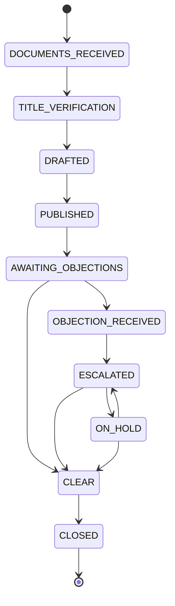

# Public Notice Workflow — UX Specification

**Workflow Slug:** `public_notice`  
**Status Field:** `public_notice_status`  
**Redis Prefix:** `notice:case:`  
**Version:** 1.0.0  
**States:** 9 (including 1 terminal + 1 exception)  
**Primary Path:** Documents Received → Title Verification → Drafted → Published → Awaiting Objections → Clear → Closed

---

## 1. State Machine Overview

### 1.1 States (9 Total)

| # | State | Category | Description |
|---|-------|----------|-------------|
| 1 | `DOCUMENTS_RECEIVED` | Initial | Property documents, title deeds received |
| 2 | `TITLE_VERIFICATION` | Process | Title search and verification by advocate |
| 3 | `DRAFTED` | Process | Public notice drafted (AI-assisted) |
| 4 | `PUBLISHED` | Process | Notice published in newspapers (English + vernacular) |
| 5 | `AWAITING_OBJECTIONS` | **Statutory Window** | Objection window open (7/15/30 days from publication) |
| 6 | `OBJECTION_RECEIVED` | **Exception** | Objection filed by third party |
| 7 | `ESCALATED` | Process | Objection escalated for legal resolution |
| 8 | `CLEAR` | Process | No objections / objections resolved |
| 9 | `CLOSED` | **Terminal** | Notice process complete |
| 10 | `ON_HOLD` | **Exception** | On hold (can return to ESCALATED or CLEAR) |

### 1.2 Transitions



### 1.3 Exception States
- `OBJECTION_RECEIVED` — Third party objection filed during window
- `ESCALATED` — Objection requires legal resolution
- `ON_HOLD` — Process paused (court stay, negotiation); can resume to `ESCALATED` or `CLEAR`

---

## 2. Mandatory Gates

### 2.1 Objection Window Gate (State: `AWAITING_OBJECTIONS`)

**Statutory Deadline:** Configurable objection window (7, 15, or 30 days) from "date of newspaper publication"

**Configuration (from workflow definition):**
- **Label:** "Objection window"
- **Windows:** 7, 15, 30 days (set per case)
- **Starts From:** "date of newspaper publication"
- **Blocking:** true

**UX Treatment:**
- **Critical:** Countdown timer visible on ALL screens during this state
- **Auto-transition:** On window expiry with no objections → `CLEAR`
- **On objection filed:** Immediate transition to `OBJECTION_RECEIVED`
- **Configuration:** Window duration set at case creation (7/15/30 days)

### 2.2 Title Verification Gate (State: `TITLE_VERIFICATION`)

**Purpose:** Advocate verifies clear title before notice publication

**UX Requirements:**
- Title search report review
- Encumbrance certificate verification
- Advocate sign-off required before drafting
- Can loop back if issues found (though not explicitly modeled as transition)

---

## 3. Evidence-First Review (Split View)

### 3.1 Title Verification Screen (`TITLE_VERIFICATION`)

```
┌─────────────────────────────────────────────────────────────────┐
│ 🔍 TITLE VERIFICATION — PN-2024-001234                         │
├─────────────────────────────────────────────────────────────────┤
│ PROPERTY: Flat 402, Sunrise Apartments, Thane West             │
│ CLIENT: HDFC Bank (for borrower Rajesh Kumar)                  │
├─────────────────────────────────────────────────────────────────┤
│ ┌──────────────────────────┬────────────────────────────────┐  │
│ │ 📋 VERIFICATION REPORT   │ 📄 SOURCE DOCUMENTS            │  │
│ │                          │                                 │  │
│ │ TITLE SEARCH RESULTS     │  TITLE DEEDS                   │  │
│ │ ┌─────────────────────┐  │  ┌─────────────────────────┐  │  │
│ │ │ Current Owner       │  │  │ Sale_Deed_2020.pdf      │  │  │
│ │ │ Rajesh Kumar ✓      │  │  │ Pages 1-12 • 98% conf   │  │  │
│ │ │                     │  │  │ Previous_Sale_Deed.pdf  │  │  │
│ │ │ Chain of Title      │  │  │ Pages 13-20 • 95% conf  │  │  │
│ │ │ Complete (3 links) ✓│  │  └─────────────────────────┘  │  │
│ │ │                     │  │                                 │  │
│ │ │ Encumbrances        │  │  ENCUMBRANCE CERTIFICATE      │  │
│ │ │ NIL ✓               │  │  ┌─────────────────────────┐  │  │
│ │ │                     │  │  │ EC_Thane_2024.pdf       │  │  │
│ │ │ Litigation          │  │  │ Period: 2000-2024       │  │  │
│ │ │ NIL ✓               │  │  │ Status: NIL             │  │  │
│ │ │                     │  │  └─────────────────────────┘  │  │
│ │ │ Mortgages           │  │                                 │  │
│ │ │ HDFC Bank (current) │  │  MUTATION RECORDS             │  │
│ │ │ No prior mortgages  │  │  ┌─────────────────────────┐  │  │
│ │ └─────────────────────┘  │  │ Mutation_Entry_2020.pdf  │  │  │
│ │                          │  │ Property tax paid ✓      │  │  │
│ │ RISK ASSESSMENT: LOW    │  │  └─────────────────────────┘  │  │
│ │                          │                                 │  │
│ │ [DOWNLOAD FULL REPORT]   │  [OPEN DOCUMENT VIEWER]        │  │
│ │ [REQUEST ADDITIONAL SEARCH]                                 │  │
│ └──────────────────────────┴────────────────────────────────┘  │
├─────────────────────────────────────────────────────────────────┤
│ [TITLE CLEAR — PROCEED TO DRAFTING]  ← Primary (green)         │
│ [ISSUES FOUND — ESCALATE]         ← Secondary (red)            │
└─────────────────────────────────────────────────────────────────┘
```

### 3.2 Notice Drafting Screen (`DRAFTED`)

```
┌─────────────────────────────────────────────────────────────────┐
│ 📝 PUBLIC NOTICE DRAFTING — PN-2024-001234                     │
├─────────────────────────────────────────────────────────────────┤
│ ┌──────────────────────────┬────────────────────────────────┐  │
│ │ 📰 NOTICE DRAFT          │ 📋 EXTRACTION EVIDENCE         │  │
│ │ (Template Editor)        │                                 │  │
│ │                          │  PROPERTY DETAILS              │  │
│ │ PUBLIC NOTICE            │  ┌──────────────────────────┐  │  │
│ │ ─────────────────        │  │ Flat 402, Sunrise Apts   │ 98%│  │
│ │                          │  │ Thane West, Mumbai 400601│    │  │
│ │ Notice is hereby given   │  │ Area: 1,200 sq ft        │ 95%│  │
│ │ that [BANK NAME]         │  │ Survey No: 123/45        │ 92%│  │
│ │ intends to sell...       │  └──────────────────────────┘  │  │
│ │                          │                                 │  │
│ │ Property: Flat 402       │  BORROWER DETAILS             │  │
│ │ Sunrise Apartments       │  ┌──────────────────────────┐  │  │
│ │ Thane West, Mumbai 400601│  │ Rajesh Kumar             │ 99%│  │
│ │                          │  │ PAN: ABCDE1234F          │ 97%│  │
│ │ Outstanding: ₹2.4 Cr     │  │ Loan A/c: HDFC/2024/456  │ 96%│  │
│ │                          │  └──────────────────────────┘  │  │
│ │ Sale Date: [TBD]         │                                 │  │
│ │                          │  TITLE VERIFICATION            │  │
│ │ Objections to be filed   │  ┌──────────────────────────┐  │  │
│ │ within [WINDOW] days     │  │ Title Clear: YES ✓       │  │  │
│ │ from publication.        │  │ Encumbrances: NIL ✓      │  │  │
│ │                          │  │ Litigation: NIL ✓        │  │  │
│ │ Contact: [ADVOCATE]      │  └──────────────────────────┘  │  │
│ │ [ADVOCATE DETAILS]       │                                 │  │
│ │                          │  AI CONFIDENCE: 96%            │  │
│ │ [REGENERATE]             │  [RE-RUN EXTRACTION]           │  │
│ │ [SAVE DRAFT]             │                                 │  │
│ │ [SEND FOR PUBLICATION]   │                                 │  │
│ └──────────────────────────┴────────────────────────────────┘  │
├─────────────────────────────────────────────────────────────────┤
│ PUBLICATION CONFIGURATION                                       │
│ Newspapers: ☑ English (Times of India)  ☑ Vernacular (Loksatta)│
│ Window: ○ 7 days  ○ 15 days  ☑ 30 days (per case config)       │
├─────────────────────────────────────────────────────────────────┤
│ [SUBMIT FOR PUBLICATION]  ← Primary                            │
│ [BACK TO TITLE VERIFICATION]                                    │
└─────────────────────────────────────────────────────────────────┘
```

### 3.3 Objection Management Screen (`OBJECTION_RECEIVED` / `ESCALATED`)

```
┌─────────────────────────────────────────────────────────────────┐
│ ⚖️ OBJECTION RECEIVED — PN-2024-001234                         │
├─────────────────────────────────────────────────────────────────┤
│ OBJECTION DETAILS                                              │
│ ┌─────────────────────────────────────────────────────────────┐ │
│ │ Objector: M/s Sharma & Associates (on behalf of Mrs. Patel)│ │
│ │ Date Filed: 2024-01-25 (Day 12 of 30-day window)           │ │
│ │ Grounds: "Prior agreement to sell executed 2023-11-15"     │ │
│ │ Evidence: Agreement copy (attached), Email correspondence  │ │
│ │                                                             │ │
│ │ [VIEW OBJECTION DOCUMENT]  [DOWNLOAD EVIDENCE]             │ │
│ └─────────────────────────────────────────────────────────────┘ │
├─────────────────────────────────────────────────────────────────┤
│ CASE IMPACT                                                     │
│ ⏰ Objection window: 18 days remaining                          │
│ 📅 Original clearance date: 2024-02-13 (30 days from publication)│
│ ⚠️ Process BLOCKED until resolution                             │
├─────────────────────────────────────────────────────────────────┤
│ RESOLUTION ACTIONS                                              │
│ ┌─────────────────────────────────────────────────────────────┐ │
│ │ ☐ Verify objection validity (title search)                 │ │
│ │ ☐ Notify bank and borrower                                  │ │
│ │ ☐ Legal opinion on prior agreement enforceability          │ │
│ │ ☐ Negotiation / settlement discussion                       │ │
│ │ ☐ Court application (if needed)                             │ │
│ └─────────────────────────────────────────────────────────────┘ │
├─────────────────────────────────────────────────────────────────┤
│ [ESCALATE FOR LEGAL RESOLUTION]  ← Primary (advances to ESCALATED)│
│ [DISMISS — FRIVOLOUS]           ← Requires advocate justification│
│ [PLACE ON HOLD]                 ← Pending court order/negotiation│
└─────────────────────────────────────────────────────────────────┘
```

---

## 4. Statutory Deadline Visualization

### 4.1 Objection Window (Configurable: 7/15/30 days)

**Applies at:** `AWAITING_OBJECTIONS` state (blocking)

**Countdown Display:**
- **Persistent banner** on all screens during `AWAITING_OBJECTIONS`
- **Color coding:**
  - > 50% window: Green
  - 25-50%: Yellow/Orange
  - < 25%: Red pulsing
  - **Day of expiry:** Red alert, vibration (mobile)
- **Auto-transition at expiry:** If no objections → `CLEAR`

### 4.2 Objection Window Dashboard

```
┌─────────────────────────────────────────────────────────────────┐
│ ⏰ PUBLIC NOTICE OBJECTION WINDOWS — Portfolio                 │
├─────────────────────────────────────────────────────────────────┤
│ CASE          │ STAGE              │ WINDOW   │ DAYS LEFT │ ACT │
├───────────────┼────────────────────┼──────────┼───────────┼─────┤
│ PN-001234     │ AWAITING_OBJECTIONS│ 30 days  │ 🟢 18     │ 👁  │
│   HDFC/Rajesh │ Published 01-07    │ Due: 02-06│ [=======>]│     │
├───────────────┼────────────────────┼──────────┼───────────┼─────┤
│ PN-001235     │ AWAITING_OBJECTIONS│ 15 days  │ 🟠 3      │ ⚠️  │
│   SBI/Priya   │ Published 01-15    │ Due: 01-30│ [=========>]│    │
├───────────────┼────────────────────┼──────────┼───────────┼─────┤
│ PN-001236     │ OBJECTION_RECEIVED │ 30 days  │ 🔴 12*    │ ⚖️  │
│   ICICI/Amit  │ Objection Day 12   │ Due: 02-10│ [=========>]│    │
├───────────────┼────────────────────┼──────────┼───────────┼─────┤
│ PN-001237     │ CLEAR              │ 7 days   │ ✅ DONE   │ ✓   │
│   BoB/Sunil   │ No objections      │ Completed│           │     │
└───────────────┴────────────────────┴──────────┴───────────┴─────┘
* Window still runs during objection resolution
```

---

## 5. Publication Tracking (`PUBLISHED` State)

```
┌─────────────────────────────────────────────────────────────────┐
│ 📰 PUBLICATION CONFIRMATION — PN-2024-001234                   │
├─────────────────────────────────────────────────────────────────┤
│ NEWSPAPER PUBLICATIONS                                          │
│ ┌─────────────────────────────────────────────────────────────┐ │
│ │ ☑ Times of India (English)                                 │ │
│ │    Date: 2024-01-20                                        │ │
│ │    Page: 12, Column: 3                                     │ │
│ │    Proof: TOI_20240120_p12.pdf  [UPLOAD PROOF]            │ │
│ │    Edition: Mumbai                                         │ │
│ ├─────────────────────────────────────────────────────────────┤ │
│ │ ☑ Loksatta (Marathi)                                       │ │
│ │    Date: 2024-01-20                                        │ │
│ │    Page: 8, Column: 2                                      │ │
│ │    Proof: Loksatta_20240120_p8.pdf  [UPLOAD PROOF]        │ │
│ │    Edition: Mumbai                                         │ │
│ └─────────────────────────────────────────────────────────────┘ │
├─────────────────────────────────────────────────────────────────┤
│ OBJECTION WINDOW STARTED                                        │
│ 📅 Publication Date: 2024-01-20                                 │
│ 📅 Window: 30 days (configured)                                 │
│ 📅 Expires: 2024-02-19 23:59                                    │
│ ⏰ Countdown: 29 days 23:45:12  [LIVE COUNTDOWN]               │
├─────────────────────────────────────────────────────────────────┤
│ [CONFIRM PUBLICATION COMPLETE]  ← Advances to AWAITING_OBJECTIONS│
│ [RE-PUBLISH]  [CORRECT ERROR]                                   │
└─────────────────────────────────────────────────────────────────┘
```

---

## 6. Task Definitions

| Task Definition ID | Stage | Assignee Role | Description |
|--------------------|-------|---------------|-------------|
| `collect_documents` | `DOCUMENTS_RECEIVED` | CLERK | Collect property docs, title deeds, EC |
| `verify_title` | `TITLE_VERIFICATION` | ADVOCATE | Title search, EC review, litigation check |
| `draft_notice` | `DRAFTED` | CLERK/ADVOCATE | Draft public notice (AI-assisted) |
| `arrange_publication` | `PUBLISHED` | EXECUTIVE | Book newspaper ads, upload proofs |
| `monitor_objections` | `AWAITING_OBJECTIONS` | CLERK/ADVOCATE | Daily check for objections, window tracking |
| `handle_objection` | `OBJECTION_RECEIVED` | ADVOCATE | Review objection, decide escalation |
| `resolve_objection` | `ESCALATED` | ADVOCATE | Legal resolution, negotiation, court |
| `clear_notice` | `CLEAR` | ADVOCATE | Confirm no valid objections, close |
| `close_case` | `CLOSED` | ADVOCATE | Final handover, audit trail |

---

## 7. Approver Mental Model

**No formal approval gate.** The advocate controls flow through:
1. Title verification sign-off (`TITLE_VERIFICATION` → `DRAFTED`)
2. Objection handling decisions (`OBJECTION_RECEIVED` → `ESCALATED`/`DISMISS`)
3. Final clearance (`CLEAR` → `CLOSED`)

### 7.1 Key Decision Points

| State | Decision | Effect |
|-------|----------|--------|
| `TITLE_VERIFICATION` | CLEAR / ISSUES | Proceed to draft or escalate |
| `OBJECTION_RECEIVED` | ESCALATE / DISMISS / HOLD | Legal resolution or continue window |
| `ESCALATED` | RESOLVE / HOLD | Clear objections or pause |
| `CLEAR` | CLOSE | Terminal |

---

## 8. Policy Gates

**None defined in workflow definition.**

---

## 9. Action Gateway Integration

**Not applicable** — Public Notice uses newspaper publication (physical/digital), not the generic Action Gateway.

---

## 10. Screen Inventory (Public Notice)

| Screen | State(s) | Primary User | Key Components |
|--------|----------|--------------|----------------|
| Document Intake | `DOCUMENTS_RECEIVED` | CLERK | Property docs, title deeds, EC upload |
| **Title Verification** | `TITLE_VERIFICATION` | **ADVOCATE** | **Search report + evidence split view** |
| Notice Drafting | `DRAFTED` | CLERK/ADVOCATE | Template editor + evidence split view |
| Publication Management | `PUBLISHED` | EXECUTIVE | Newspaper booking, proof upload |
| **Objection Window** | `AWAITING_OBJECTIONS` | CLERK/ADVOCATE | **Live countdown, daily monitoring** |
| Objection Handling | `OBJECTION_RECEIVED` | ADVOCATE | Objection review, evidence, decision |
| Escalation Management | `ESCALATED` | ADVOCATE | Legal resolution tracking |
| Clearance | `CLEAR` | ADVOCATE | Final confirmation, no-objection certificate |
| Case Closure | `CLOSED` | ADVOCATE | Summary, bank handover, audit trail |
| On Hold | `ON_HOLD` | ADVOCATE | Hold reason, resume actions |

---

## 11. On Hold Flow (`ON_HOLD` State)

```
┌─────────────────────────────────────────────────────────────────┐
│ ⏸️ PUBLIC NOTICE ON HOLD — PN-2024-001234                      │
├─────────────────────────────────────────────────────────────────┤
│ HOLD REASON:                                                   │
│ ┌─────────────────────────────────────────────────────────────┐ │
│ │ ☐ Court stay order received                                │ │
│ │ ☐ Settlement negotiation in progress                       │ │
│ ☑ Objection requires High Court ruling                       │ │
│ │ ☐ Awaiting additional evidence from objector               │ │
│ │ ☐ Other: _______________________________________________  │ │
│ └─────────────────────────────────────────────────────────────┘ │
├─────────────────────────────────────────────────────────────────┤
│ OBJECTION WINDOW STATUS:                                        │
│ Original expiry: 2024-02-19 (30 days from publication)         │
│ Days elapsed at hold: 12                                        │
│ Days remaining on resume: 18                                    │
│ **Window PAUSED during hold**                                   │
├─────────────────────────────────────────────────────────────────┤
│ [RESUME — ESCALATED]  ← Continue legal resolution              │
│ [RESUME — CLEAR]      ← Objection resolved, proceed to close   │
│ [EXTEND HOLD]         ← Update expected resolution date        │
└─────────────────────────────────────────────────────────────────┘
```

---

## 12. Audit Capture

**Events to capture:**
- `WORKFLOW_INSTANCE_STARTED`
- `TASK_CREATED` / `TASK_COMPLETED` (each stage)
- `DOCUMENT_VERSION_CREATED` (notice drafts, publication proofs, objection docs)
- `EXTERNAL_ACTION` (newspaper publication confirmations)
- `DEADLINE_TRIGGERED` / `DEADLINE_COMPLETED` / `DEADLINE_BREACHED` (objection window)
- `WORKFLOW_INSTANCE_COMPLETED` (on CLOSED)

---

## 13. Integration Points

| Integration | Table/Function | UX Trigger |
|-------------|----------------|------------|
| Workflow Instance | `workflow_instances` (slug: `public_notice`) | State-driven navigation |
| Tasks | `tasks` | Task assignment per stage |
| Deadlines | `deadlines` (type: `statutory`) | Objection window countdown |
| Documents | `document_versions` | Title docs, notice drafts, proofs, objections |
| Audit | `audit_trail` | History panel |

---

## 14. Responsive & Accessibility

Same standards as Bank Recovery workflow (WCAG 2.2 AA, responsive breakpoints).

**Special consideration for objection window:**
- Countdown timer must be announced to screen readers (aria-live="polite")
- High contrast mode for deadline colors
- Keyboard shortcut to jump to objection window dashboard

---

*Document Version: 1.0.0*  
*Generated from: 0009_workflow_persistence.sql (public_notice seed)*